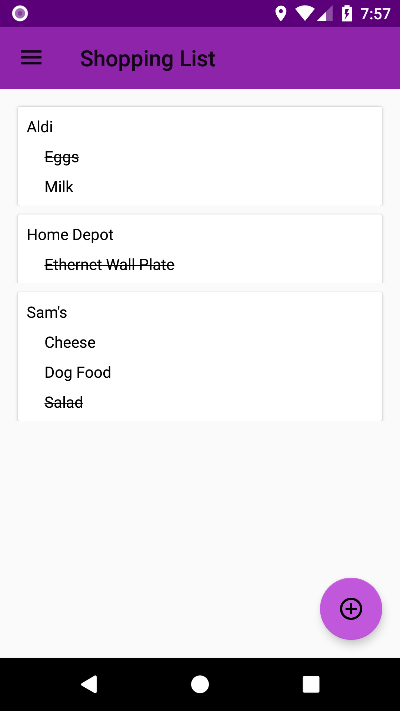
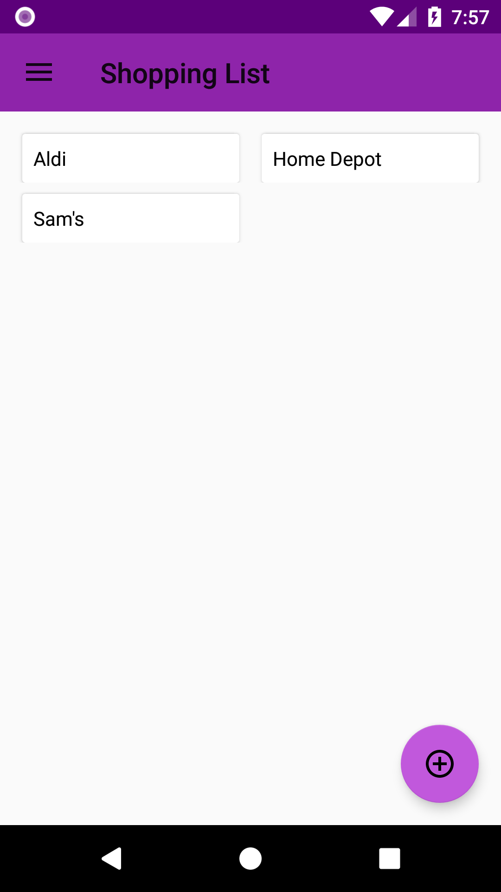
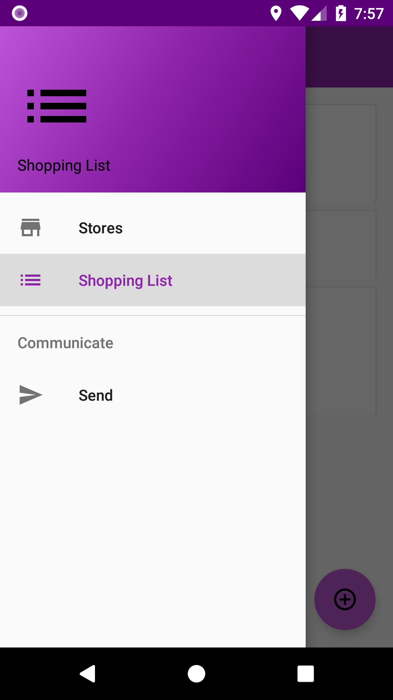
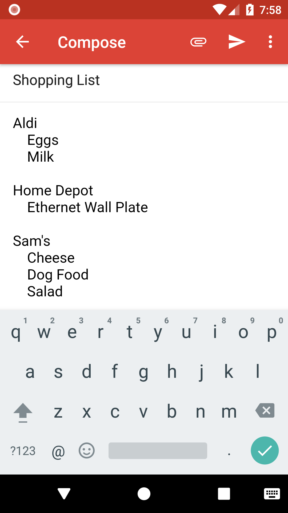

# AndroidShoppingList

An Android app for organizing a shopping list. This is an improved version of my senior project. I wanted to see what had changed in Android development.

## Getting Started

Install Android Studio.

### Prerequisites

* Android Studio – [https://developer.android.com/studio/]

### Installing

Download the repository from GitHub, either through the command line or with the "Clone or download" button. Open Android Studio and choose File/Open. Navigate to the downloaded project and press OK. 
Press the Run button in Android Studio. 

Android Studio will walk you through downloading necessary components. When prompted choose any phone to emulate with any version of Android after 26. The shopping list should open in the emulator.

## Operation

New Items are added by selecting the floating action button in the bottom right. Enter an item name, store name and select whether the item reoccurs.

The main screen will show a list of all items divided into stores. Selecting an item will cross the item out. Exiting the app will cause crossed out items that reoccur to not be crossed out anymore and it will delete items that do not reoccur. Selecting a store will show the list of items just from that store. You can also long press an item or a store to delete the item or store.

The navigation drawer can be opened by pressing the three lines in the top left or from swiping from the left. From the navigation drawer you can choose to view the full list, the list of stores, or choose to email the shopping list. 

Choosing to email the list of stores will allow you to choose your email application and send the list by email. If you are viewing the full list, it will email the full list. If you are viewing a single store, it will email the list from that store.

From the list of stores, you can choose one store to view the corresponding list or you can delete stores with a long press.

## Screenshots

  
  

## Running the tests

Tests can be run from Android Studio. Right click the test and choose run or right click the test folder and choose Run ‘Tests in ‘.

## Built With

* [Android Studio]( https://developer.android.com/studio/)

## Authors

* **Dan Jeffries** - [dajeffri](https://github.com/dajeffri)

## License

This project is licensed under the MIT License - see the [LICENSE.md](LICENSE) file for details
